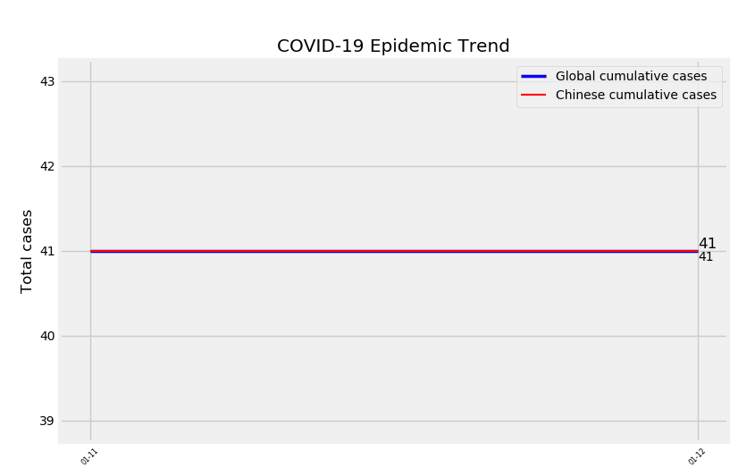

At the beginning of the new year 2020, the novel coronavirus is the topic that people most concerned about globally. Up to Mar.4th,2020, the virus is affecting 82 countries and territories around the world. In total, it causes 94,380 confirmed cases and 3,221 deaths.( _[Data comes from Worldometer](https://www.worldometers.info/coronavirus/)_) 

The virus is highly contagious and spreading fast. People get updated information from official news reports. However, these updates are segmented and unable to reflect the entire situation. Data reporting helps to collect all those fragmented information and becomes more effective in easing the public understanding severeness of the epidemic. People could intuitively sense the spreading speed and prepare in advance. 

Line charts are commonly used on various channels to represent the epidemic trend. But most of charts are static. Is it possible to animate the line chart and dynamically show the spreading process? There are many tools to realize that. At this time, I use Python Matplotlib Animation.

Here is what I make:

_Data comes from [The Paper & Sixth Tone, "COVID-19 Updates."](https://github.com/839Studio/Novel-Coronavirus-Updates)_

## **Core codes**
Skipping the part of data processing, the following is the core.

```python
fig2 = plt.figure(3)
ax1 = fig2.add_subplot(1,1,1)

xt=[]       
yt=[]        
yc=[]  
def animate2(i):   
    if len(xt)==len(sumbydate['Date']):
        xt.clear()      
        yt.clear()       
        yc.clear()
    xt.append(sumbydate['Date'][i]) 
    yt.append(sumbydate['Cum_Newcase_T'][i])
    yc.append(sumCN['Cum_Newcase_CN'][i])
    return  plot_durations(xt,yt,yc)

def init():
    p1=plt.plot(sumbydate['Date'][0],sumbydate['Cum_Newcase_T'][0],'b-',linewidth=2.5,label='Global cumulative cases')
    p2=plt.plot(sumbydate['Date'][0],sumCN['Cum_Newcase_CN'][0],'r-',linewidth=1.5,label='Chinese cumulative cases')
    return p1+p2

def plot_durations(x,y1,y2):
    plt.clf()
    plt.plot(x,y1,'b-',linewidth=2.5,label='Global cumulative cases')
    plt.plot(x,y2,'r-',linewidth=1.5,label='Chinese cumulative cases')
    
    plt.text(x[-1], y1[-1], y1[-1], ha='left', va='bottom', fontsize=12)
    plt.text(x[-1], y2[-1], y2[-1], ha='left', va='top', fontsize=10)
    
    plt.xlabel('Date')
    plt.ylabel('Total cases')
    plt.title('COVID-19 Epidemic Trend')
    plt.xticks(rotation=45,fontsize='xx-small',fontweight='light',fontstretch='condensed')
    plt.legend()


ani = animation.FuncAnimation(fig2, animate2,len(sumbydate['Date']),interval=500,init_func=init)
plt.show()
```
( _[Entire codes](https://github.com/garyyolo/Toy-Projects/blob/master/Animated%20Data%20Visualization-COVID-19.py)_ )

The Matplotlib.animation is the core to realize the dynamic effect. Besides using FuncAnimation, for loop is an alternative method to realize the animation.

```python
plt.ion()

def plot_durations(x,y1,y2):
    plt.figure(2)
    plt.clf()
    plt.plot(x,y1,'b-',linewidth=2.5,label='Global cumulative cases')
    plt.plot(x,y2,'r-',linewidth=1.5,label='Chinese cumulative cases')
    plt.xticks(rotation=45,fontsize='xx-small',fontweight='light',fontstretch='condensed')
    plt.xlabel('Date')
    plt.ylabel('Total cases')
    plt.title('COVID-19 Epidemic Trend')
    
    plt.text(x[-1], y1[-1], y1[-1], ha='left', va='bottom', fontsize=12)
    plt.text(x[-1], y2[-1], y2[-1], ha='left', va='top', fontsize=10)
    
    plt.legend() 
    
    plt.pause(0.5)  # pause a bit so that plots are updated
    if is_ipython:
        display.clear_output(wait=True)
        display.display(plt.gcf())

xt=[]       
yt=[]        
yc=[]        
for i in range(len(sumbydate['Date'])):
    xt.append(sumbydate['Date'][i]) 
    yt.append(sumbydate['Cum_Newcase_T'][i])
    yc.append(sumCN['Cum_Newcase_CN'][i])
    plot_durations(xt,yt,yc)
```
## **GUI & Export**

I script in the jupyter notebook. It offers different GUI options. Personally, I prefer using this one. It embeds the dynamic chart in the notebook.

```python
%matplotlib notebook
```
Or you can choose to use [pop-up windows](https://blog.csdn.net/u013468614/article/details/58689735) in jupyter.
```python
%matplotlib qt5 
is_ipython = 'qt5' in matplotlib.get_backend() 
if is_ipython: 
  from IPython import display
```

Different from chart animated by for loop, the Matplotlib.animation supports converting charts into Gif or video files. If you are not familiar with file converting, you may use [ScreenToGif](https://www.screentogif.com/) to record and edit the animation. It supports saving files in Gif and Video formats.

I hope this post may help you too! If you have any questions, you are always welcome to contact me.
