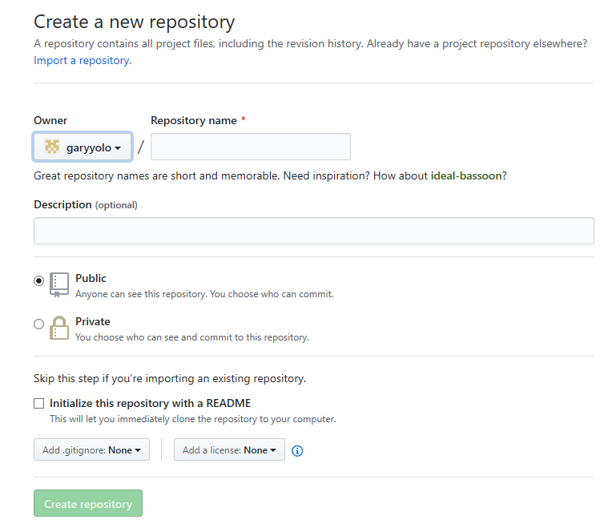
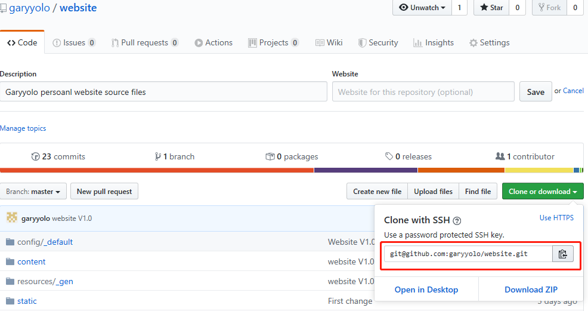
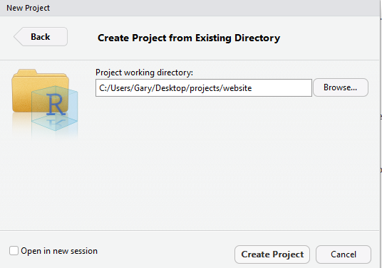
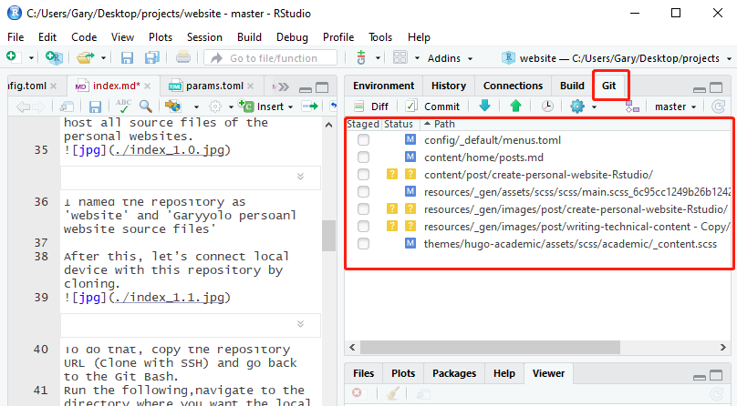
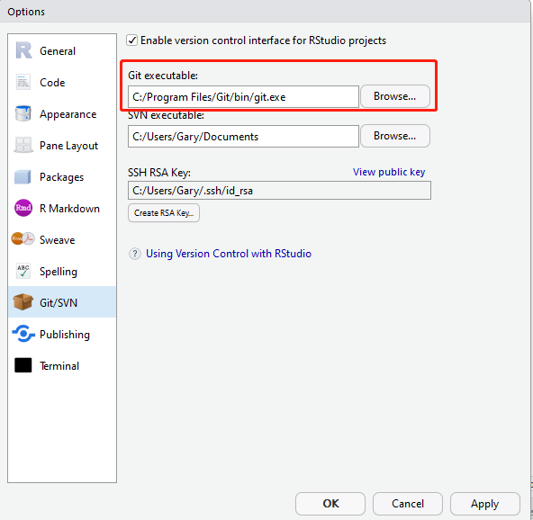

Have you ever thought about creating a personal website but gave up soon due to little knowledge of HTML/CSS, just like me? You might have tried creating blogging sites on some blog platforms but complained about the restrictions on the design. You might also see some Wix or WordPress ads on social media but hesitated to build those high-level websites. Here I would like to share with you another way to create personal websites. It does not require knowledge in website scripting languages, it offers numerous themes for modification, and it is free. 
The following tutorial is inspired by a blog on Medium [A Data Analyst’s Guide to Creating Your Personal Website with R](https://towardsdatascience.com/a-data-analysts-guide-to-creating-your-personal-website-with-r-f0079ba9b81c). I summarize the steps of creation and add solutions to problems that I encountered. I hope it could be a reference for you to create your personal websites.

## What you will need

- [x] Git and Github navigation
- [x] Rstudio with Git tab
- [x] Netlify

I create my personal website using blogdown, which is the tool built to significantly simplify the whole process from creating a website to updating the website. The process of creation basically comprises four parts:

**Create a new repository on Github → Build website in RStudio → Deploy website using Netlify → Modify contents of your websites.**

This post mainly introduces the first three steps. The tutorial of the last step is separated into different components of the theme package which I will discuss about later.

## Create a new repository on Github
For those who have not used Github before, the blog [How to Properly Setup Your Github Repository — Windows Version](https://medium.com/@aklson_DS/how-to-properly-setup-your-github-repository-windows-version-ea596b398b) helps you install Github on local devices and teach you how to commit changes and syncronize on the Github platform.

As the instruction, after running the following in the Git Bash Terminal, a profile named as 'projects' appears on desktop.
```bash
mkdir ~/Desktop/projects
```

Then, we need to create a new repository on Github webpage to host all source files of the personal websites.

I named the repository as 'website' and 'Garyyolo personal website source files'

After this, let’s connect local devices with this repository by cloning. 

To do that, copy the repository URL (Clone with SSH) and go back to the Git Bash.
Run the following, navigate to the directory where you want the local version of the repository to reside.
```bash
cd ~/Desktop/projects
```
Then, replace the repository URL and run.
```bash
git clone <repository_URL>
```
```bash
ls
```
You should see a new folder with the name of the repository appears. In my case, a folder with a name as 'website' appears after running ls. Now, the first step is finished.

## Build website in RStudio
We need to install the blogdown package. Run the following in the console:
```rscript
install.packages("blogdown")
blogdown::install_hugo()
```
Then create a new project in RStudio. Select **File >New Project> Existing Directory**, then browse the directory where the GitHub repository is and click on the Create Project button.


RStudio will open a new session of this project. We now need to edit the .gitignore file. This file manages files that will not be synchronized with Github. You can find it from the **Files** panel in RStudio (normally locates at the lower-right panel). Edit the content as follow:
```rscript
.Rproj.user
.Rhistory
.RData
.Ruserdata
public/ 
```
Then,  start to build our website running:
```rscript
blogdown::new_site(theme = "gcushen/hugo-academic", theme_example = TRUE)
```
I selected Academic theme. You may replace the theme with other options from [Hugo](https://themes.gohugo.io/).

The original website shows up in **Viewer** tab in RStudio, and several folders will be created automatically in the folder. These are necessary components for your website.

If you make any change on components later, you can run the following to see effects.
```rscript
blogdown::serve_site()
```
Up to now, the website is created on your local devices. Next, we need to upload these original files to Github. This step should be the hardest one.**First, make sure link Github with Rstudio.** You can check if there is a **Git** tab in your Rstudio.

If you cannot find the tab, Select **Tools >Global Options> Git/SVN** and search for git executable. Then click the OK button.

Every time you make changes on components, the changed documents will appear under the Git tab. You click the **Commit**, a new window pops out. Select items to be synchronized, note the commitment with a message, and click Push. Then you can see the Github will be synchronized as your local files.
However, at the very beginning, the components remain original without any change. Therefore, you need to git each file manually for the first time.
Go back to the Git Bash and replace <foldername> with the files in your repository with the following command:
```bash
git add <foldername>
```
After doing this, you can see all the files in the repository appear under the Git tab in Rstudio, and you can push them to the Github.

## Deploy website using Netlify

Sign up with Github account in [Netlify](https://app.netlify.com) for free website services. Netlify can automatically read data from Github to generate websites. Therefore, we need to link your personal website repository with Netlify. Select **New site from Git -> Continuous Deployment: GitHub**, and select your GitHub repository with website files. Then we need to adjust the environment settings of the Netlify as the following guidance.

You can check your Hugo version by running the following code in the Rstudio console.
```rscript
blogdown::hugo_version
```
Once the Netlify informs your site is deployed, you may find your default website address under the **overview** tab. Open the link and check the webpage status. If you want to customize the domain name, follow the instructions on the Netlify. As you may know, customization, in most cases, is not for free.
### Congratulations! You deploy a personal website successfully. 

I hope this post may help you too! If you have any questions, you are always welcome to contact me.
